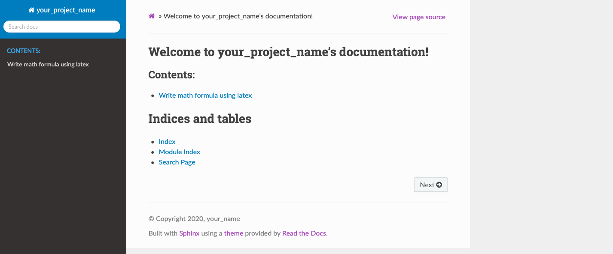
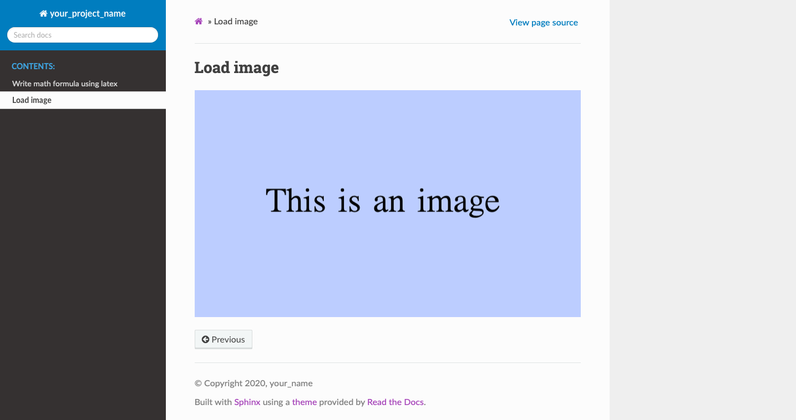

This is the instruction file
============================

Follow the steps below will help have a basic understanding of Sphinx building. 

Step 1. Package Install and Preparations
########################################

Install Sphinx::

   $ pip install sphinx

Download directory from GitHub::

   $ git clone https://github.com/User-zwj/pagetest2.git

Sphinx startup::

   $ cd pagetest2
   $ mkdir docs
   $ cd docs
   $ sphinx-quickstart

Once using ``$ sphinx-quickstart`` command, you will need to customize it::

   > Separate source and build directories (y/n) [n]: n
   > Project name: your_project_name
   > Author name(s): your_name
   > Project release []: 1.0
   > Project language [en]: en

You will later have the directory shown below:

.. image:: _static/images/directory.png

Use the code below to setup the webpage:

.. image:: _static/images/web_start.png

If you would like to change the project name, copyright, author settings, you can go to **conf.py** and make corresponding changes.

In order to change the theme to the following theme in the plot,

download the theme first::

   $ pip install sphinx-rtd-theme

then change the theme in the **conf.py** to ``html_theme = 'sphinx_rtd_theme'``.

Now use the following command to setup the webpage::

   $ make html
   $ open _build/html/index.html

the webpage will then become:

Step 2. Math formulas in LATEX
##############################

Use command to create **latex.rst** file::

   $ vim latex.rst

and put the following content in **latex.rst**::

   Write math formula using latex
   ==============================

   .. math::

       S = \sum_{k=0}^{N} x_k

Then update **index.rst** by adding ``latex`` to it::

   .. toctree::
   :maxdepth: 2
   :caption: Contents:

   latex

Update the webpage and load it::

   $ make html
   $ open _build/html/index.html

The latex formula will be added to the webpage:

Click ``Write math formula using latex`` to access the conten, you will have

Step 3. Image
#############

To add a picture, use ``.. image:: directory_of_the_picture``. To store the pictures needed, create **images** directory under **_static** directory. 

First create **loadimage.rst**, and add the fllowing content to it::

   Load image
   ==========

   .. image:: _static/images/image1.png

Then update **index.rst** by adding ``loadimage`` to it::

   .. toctree::
   :maxdepth: 2
   :caption: Contents:

   latex
   loadimage

Update the webpage and load it::

   $ make html
   $ open _build/html/index.html

The image will be added to the webpage:

Click ``Load image`` to access the content, you will have

Step 4. RST syntax
##################

Step 5. Load content from .py file
##################################

Step 6. Load content from .ipynb file
#####################################

